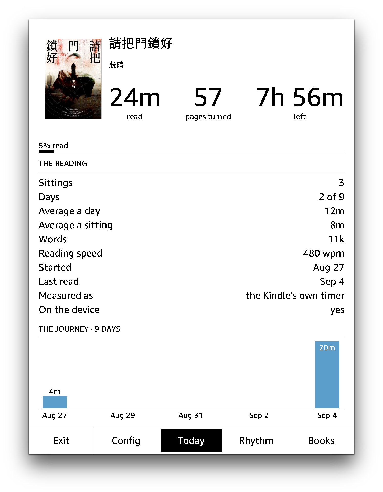
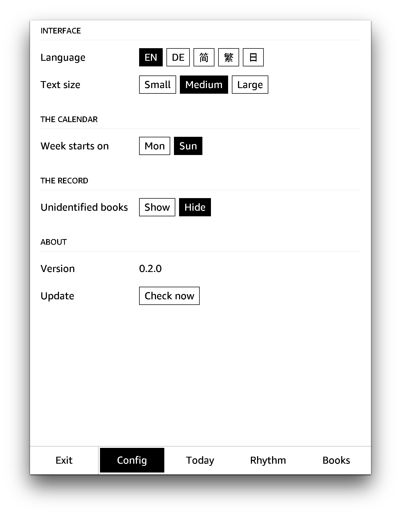
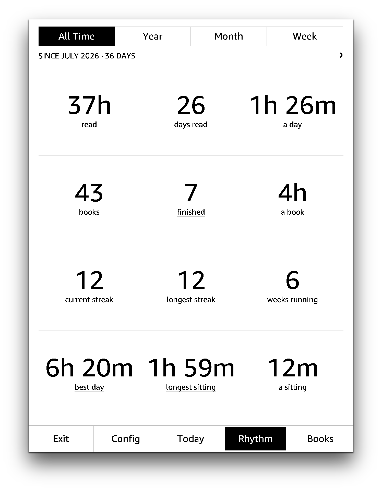
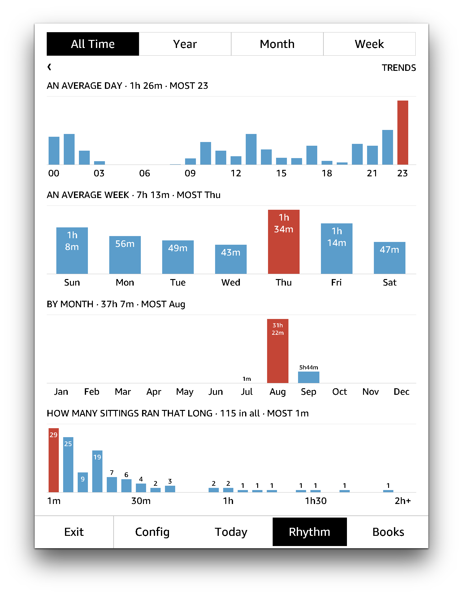
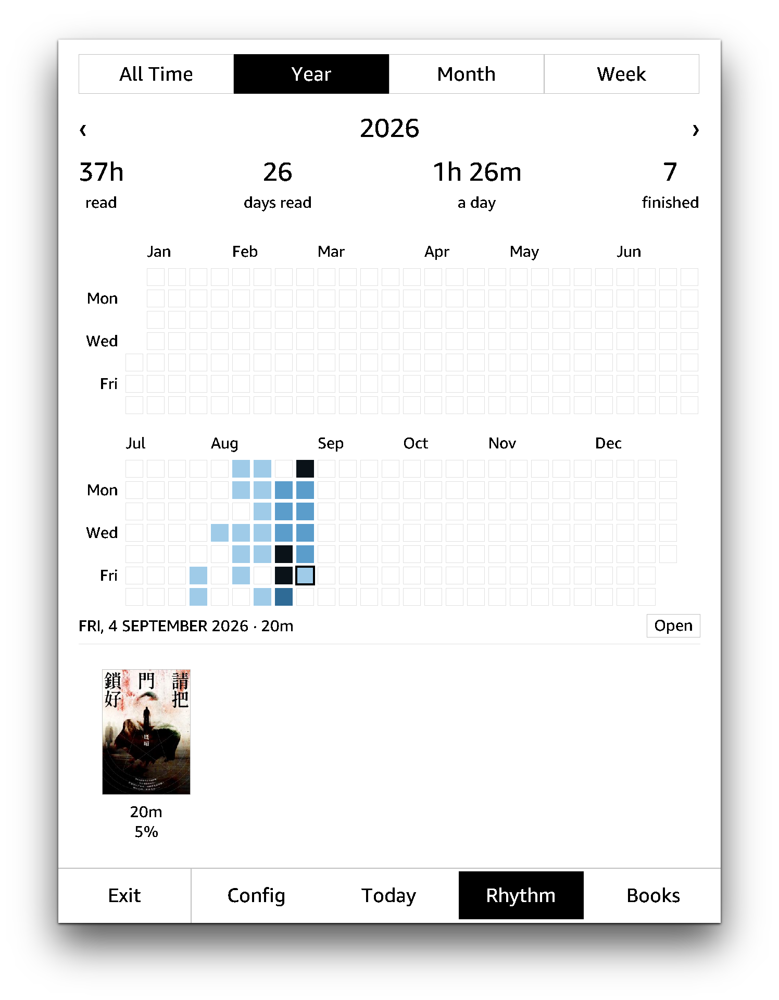
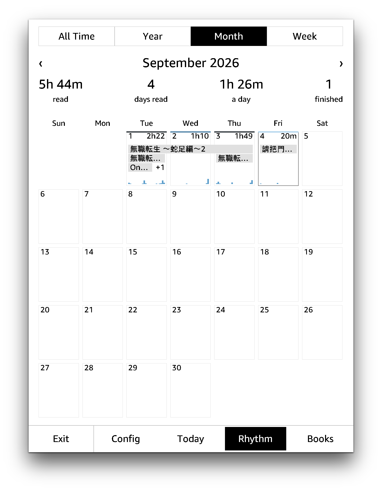
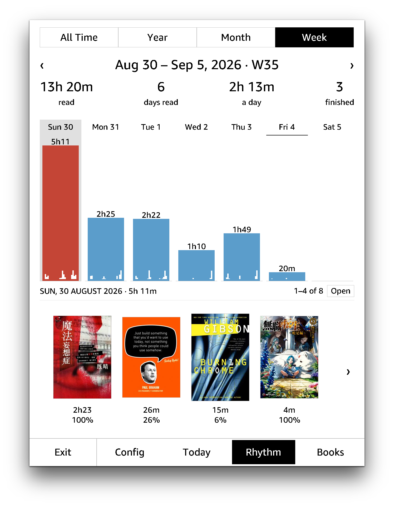

# Reading Log

Keep track of your reading, for jailbroken kindles. 

## Build

```sh
git clone https://github.com/huangziwei/readinglog && cd readinglog/
./build.sh
```

## Install

Download and unzip the latest `readinglog-v<x.y.z>-kindle.zip` from the [release page](https://github.com/huangziwei/readinglog/releases), then copy two things onto the device:

| from | to | notes |
|:--|:--|:-- |
| `extensions/readinglog/` | `/mnt/us/extensions/readinglog/` | it has to be here |
| `documents/ReadingLog.sh` | `/mnt/us/documents/ReadingLog.sh` | or any subfolders within `documents`  |

## Screenshots

<p align="center">
    
    
    
</p>

<p align="center">    
    
    
    
</p>

<p align="center">
    
    
    
</p>
