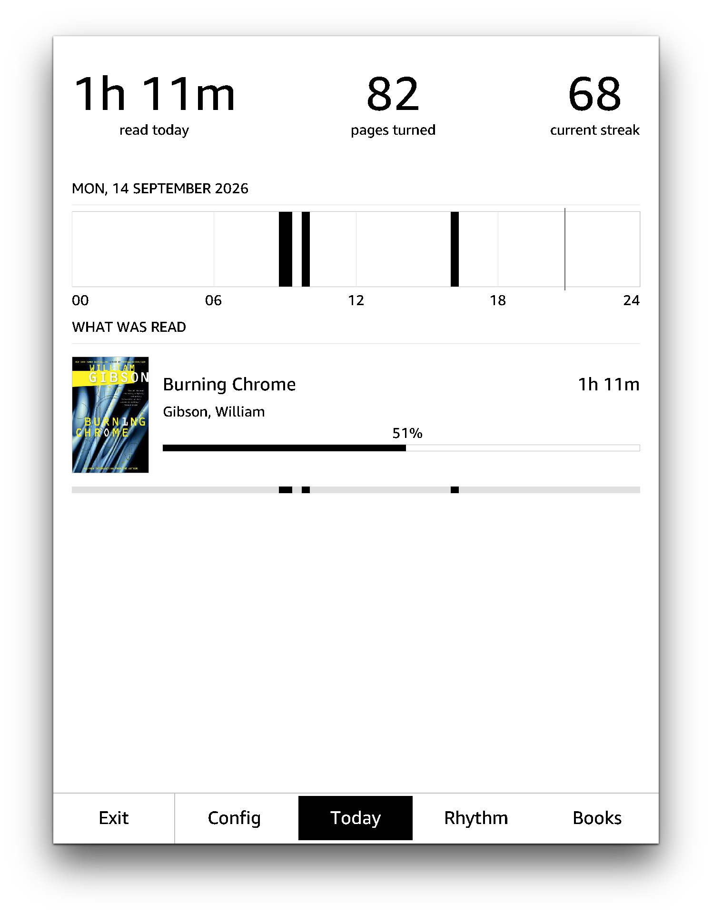
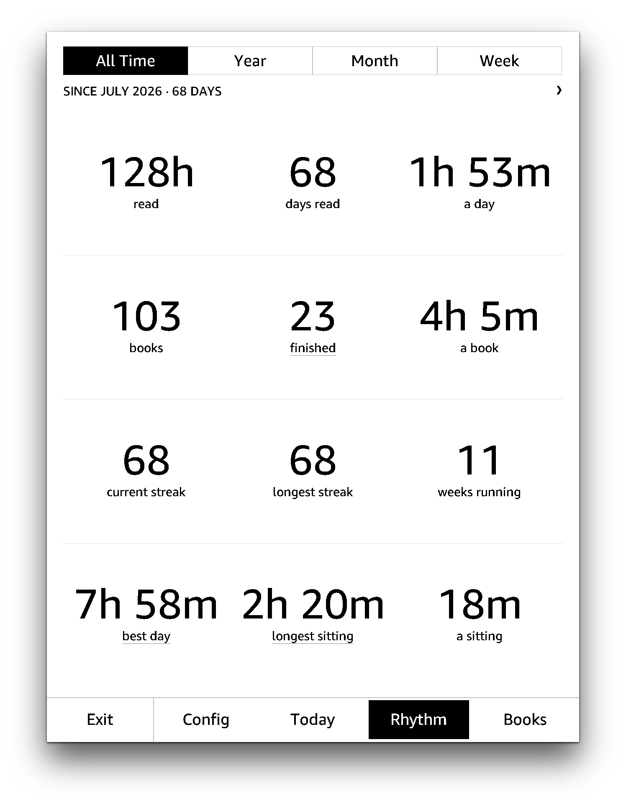
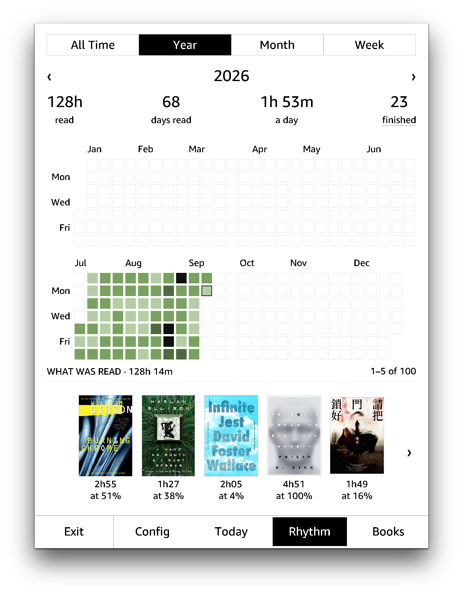
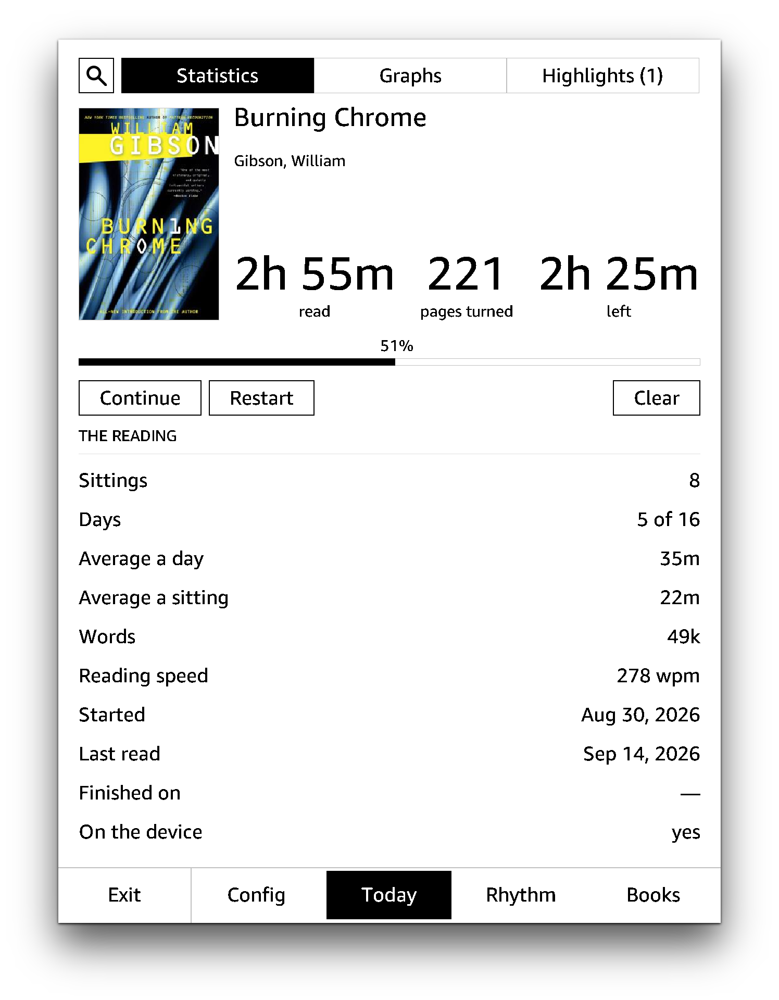
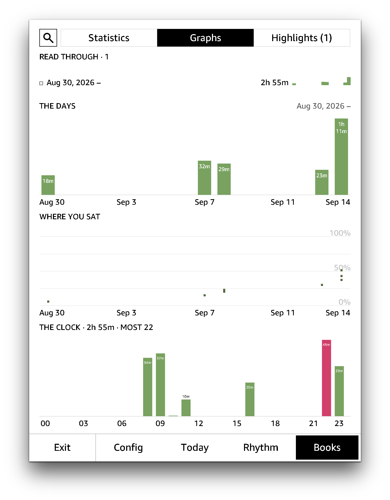
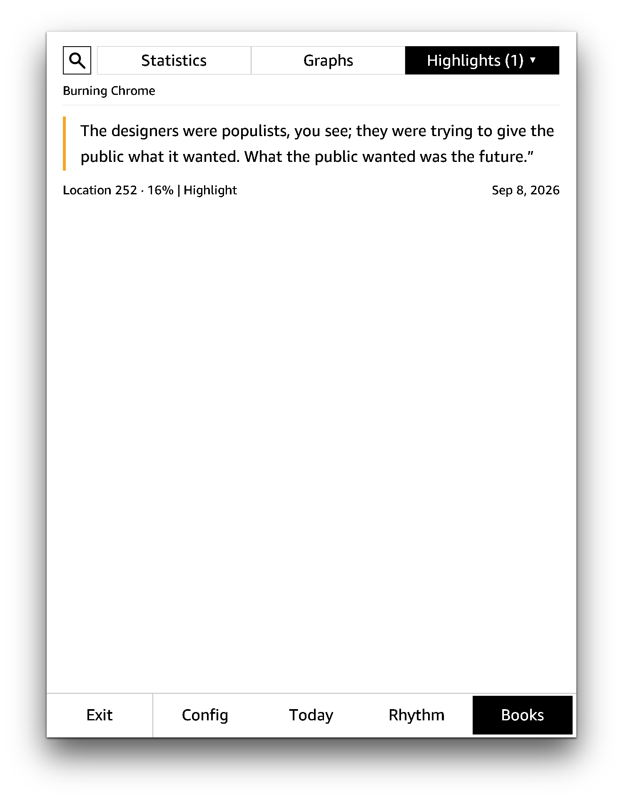
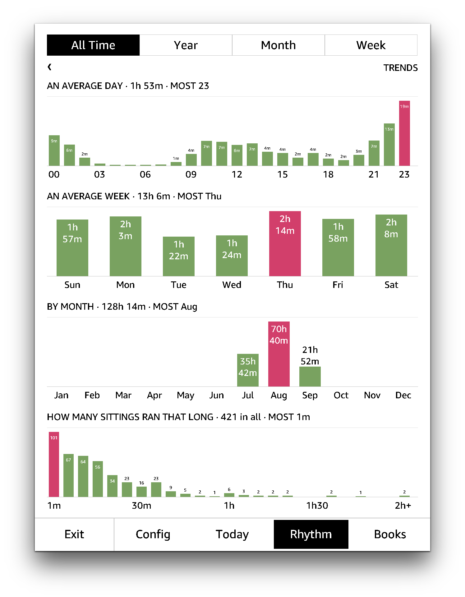
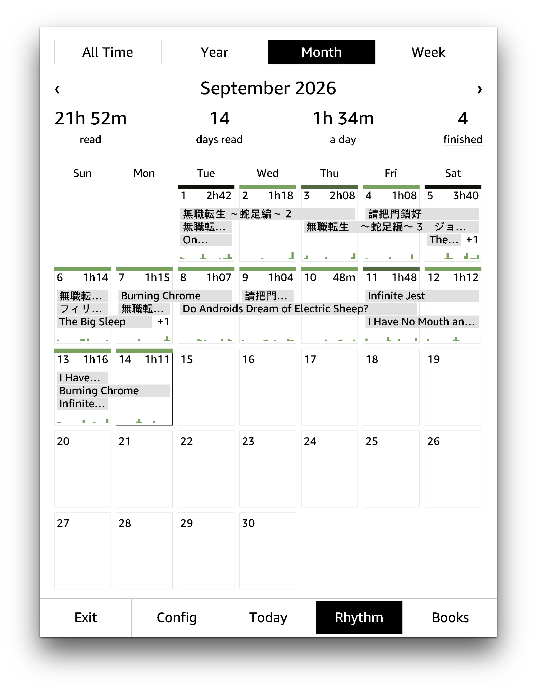
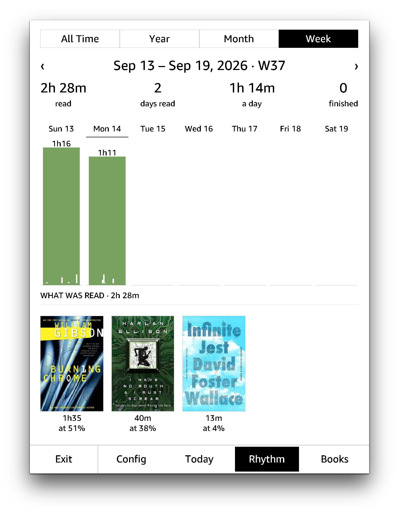

# Reading Log

Keep track of your reading stats by parsing the local system logs on your jailbroken Kindle.  

<p align="center">
    
    
    
</p>

## Install

Download and unzip the latest `readinglog-v<x.y.z>-kindle.zip` from the [release page](https://github.com/huangziwei/readinglog/releases), then copy two things onto the device:

| from | to | notes |
|:--|:--|:-- |
| `extensions/readinglog/` | `/mnt/us/extensions/readinglog/` | it has to be here |
| `documents/ReadingLog.sh` | `/mnt/us/documents/ReadingLog.sh` | or any subfolders within `documents`  |

If this is your first ever homebrew Kindle extension, you can just copy the whole `extensions` folder to `/mnt/us/`. `/mnt/us/` is the default folder when you plug in your Kindle to a computer.

## Update

Use the Update button within the `config` tab in the app via WIFI, when possible. If it doesn't work, update it manually by copying the `extensions/readinglog/bin` to `/mnt/us/extensions/readinglog/bin`, **not the whole `readinglog/` folder**, otherwise you will remove the `sessions.tsv` file and existing backups and lost all parsed data.

## Build from source

```sh
git clone https://github.com/huangziwei/readinglog && cd readinglog/
./build.sh
```

## How It Works

On your Kindle, live log is kept in `/var/log/messages`. Every 15 mins, the live log will be rotated out and be kept in `/var/local/log`, and then a daily backup will be generated the first time you turn on the device in a given day, and be saved to `/mnt/us/system/logbackup`. All your reading statistics are buried in those logs. 

Book identity is redacted in most of the logs, but can be recovered by looking up some shared stats in `/var/local/metadata/cc.db`, given the books are still on the device. Books already removed from the device before the first use of this app can only be rescued to a certain extend via correlating the logs with some indirect sources, such as `/mnt/us/system/vocabulary/vocab.db` (if you ever look up a word in that book), `/mnt/us/documents/My Clippings.txt` (if you ever highlighted a sentence in that book) and the `.sdr` of each book (if you didn't remove them from the device after removing the book).

Backlogs can only go back 30 days of use, and they might not even be complete due to file size limit, and removed sideloaded books will not have covers. Don't expect too much from the backlogs, you might be happier if you just reset the history and start tracking from today. 

## More Screenshots

### Books

<p align="center">
    
    
    
</p>

### Rhythm

<p align="center">    
    
    
    
</p>
